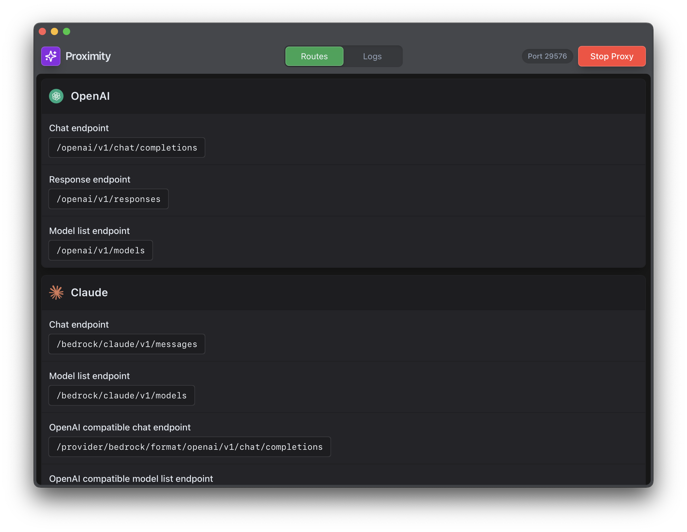

# Proximity

A desktop application to proxy AI-Gateway built with [Wails](https://wails.io/). Proximity exposes standard LLM provider endpoints enabling you to use various enterprise AI models.

## Purpose

Proximity serves as a bridge between LLM clients and AI-Gateway which is the compliant API and provides the best models in an API which differs slightly from the upstream provider APIs.

There is no authentication required from clients, the proxy automatically handles SLAuth authentication with AI-Gateway for all endpoints. You don't need to provide any API keys or authentication tokens when making requests to the proxy.

## Installation

### Download Pre-built Application

Download the latest release for macOS (ARM64):

```bash
curl -O https://statlas.prod.atl-paas.net/vportella/proximity/proximity-arm64-latest.tar.gz
tar -xzf proximity-arm64-latest.tar.gz
```

Remove macOS quarantine attribute:

```bash
xattr -d com.apple.quarantine Proximity.app
```

### Build from Source

#### Prerequisites

- Go 1.21 or later
- Node.js 16+ and npm
- [Wails CLI](https://wails.io/docs/gettingstarted/installation) v2

#### Build Steps

```bash
# Clone the repository
git clone git@bitbucket.org:atlassian-developers/proximity.git
cd proximity

# Install dependencies
npm install --prefix frontend

# Run in development mode
make run

# Build for production
make build

# Create distributable package
make package
```

## Screenshot



## Usage

The proxy runs on port `29576` (or `29575` for development) and provides multiple endpoints to mimic different LLM providers.

### OpenAI Endpoints

Drop-in replacement for OpenAI's APIs.

#### Chat Completions

**Endpoint:** `http://localhost:29576/openai/v1/chat/completions`

```bash
curl -X POST http://localhost:29576/openai/v1/chat/completions \
  -H "Content-Type: application/json" \
  -d '{
    "model": "gpt-5-2025-08-07",
    "messages": [{"role": "user", "content": "Hello!"}]
  }'
```

#### Responses API

**Endpoint:** `http://localhost:29576/openai/v1/responses`

```bash
curl -X POST http://localhost:29576/openai/v1/responses \
  -H "Content-Type: application/json" \
  -d '{
    "model": "gpt-5-2025-08-07",
    "input": "Hello, how are you?"
  }'
```

#### Image Generation

**Endpoint:** `http://localhost:29576/openai/v1/images/generations`

```bash
curl -X POST http://localhost:29576/openai/v1/images/generations \
  -H "Content-Type: application/json" \
  -d '{
    "model": "dall-e-3",
    "prompt": "A beautiful sunset over mountains"
  }'
```

#### List Models

```bash
curl http://localhost:29576/openai/v1/models
```

### Claude via Bedrock

Native Anthropic Messages API format proxied through AWS Bedrock.

**Endpoint:** `http://localhost:29576/bedrock/claude/v1/messages`

```bash
curl -X POST http://localhost:29576/bedrock/claude/v1/messages \
  -H "Content-Type: application/json" \
  -d '{
    "model": "anthropic.claude-sonnet-4-5-20250929-v1:0",
    "stream": false,
    "max_tokens": 1024,
    "messages": [{"role": "user", "content": "Hello, Claude!"}]
  }'
```

**Features:**

- Streaming support: set `"stream": true` in request body
- Automatic injection of `anthropic_version: "bedrock-2023-05-31"`
- Model name auto-conversion: `claude-sonnet-4-5-20250929` → `anthropic.claude-sonnet-4-5-20250929-v1:0`

**List available models:**

```bash
curl http://localhost:29576/bedrock/claude/v1/models
```

### Claude via Vertex AI

Native Anthropic Messages API format proxied through Google Vertex AI.

**Endpoint:** `http://localhost:29576/vertex/claude/v1/messages`

```bash
curl -X POST http://localhost:29576/vertex/claude/v1/messages \
  -H "Content-Type: application/json" \
  -d '{
    "model": "claude-sonnet-4-5@20250929",
    "stream": false,
    "max_tokens": 1024,
    "messages": [{"role": "user", "content": "Hello, Claude!"}]
  }'
```

**Features:**

- Streaming support: set `"stream": true` in request body
- Automatic injection of `anthropic_version: "vertex-2023-10-16"`

**List available models:**

```bash
curl http://localhost:29576/vertex/claude/v1/models
```

### Claude with OpenAI-Compatible Format

Use Claude models with OpenAI-compatible clients without code changes.

**Endpoint:** `http://localhost:29576/provider/bedrock/format/openai/v1/chat/completions`

```bash
curl -X POST http://localhost:29576/provider/bedrock/format/openai/v1/chat/completions \
  -H "Content-Type: application/json" \
  -d '{
    "model": "anthropic.claude-sonnet-4-5-20250929-v1:0",
    "messages": [{"role": "user", "content": "Hello!"}]
  }'
```

**Features:**

- Accepts OpenAI Chat Completion format
- Translates to Bedrock/Anthropic under the hood
- Returns OpenAI-compatible responses
- Streaming supported: returns `chat.completion.chunk` frames
- Tool/function calling support with OpenAI format conversion

**List available models:**

```bash
curl http://localhost:29576/provider/bedrock/format/openai/v1/models
```

### Google Gemini

Content generation endpoints for Google's Gemini models.

**Endpoints:**

- Generate: `http://localhost:29576/google/gemini/v1beta/models/{model}:generateContent`
- Stream: `http://localhost:29576/google/gemini/v1beta/models/{model}:streamGenerateContent`

```bash
curl -X POST "http://localhost:29576/google/gemini/v1beta/models/gemini-2.5-pro:generateContent" \
  -H "Content-Type: application/json" \
  -d '{
    "contents": [{"parts": [{"text": "Hello, Gemini!"}]}]
  }'
```

### Multiple Use-Cases via Profiles

Proximity supports multiple simultaneous use-cases through profiles. Each profile can have its own Atlassian Cloud ID, use case ID, and AD group for authentication. This allows you to route requests to with AI-Gateway auth configurations without restarting the proxy.

**Route via URL prefix:**

```bash
curl -X POST http://localhost:29576/p/my-profile/openai/v1/chat/completions \
  -H "Content-Type: application/json" \
  -d '{
    "model": "gpt-5-2025-08-07",
    "messages": [{"role": "user", "content": "Hello!"}]
  }'
```

**Route via header:**

```bash
curl -X POST http://localhost:29576/openai/v1/chat/completions \
  -H "Content-Type: application/json" \
  -H "X-Proximity-Profile: my-profile" \
  -d '{"model": "gpt-5-2025-08-07", "messages": [{"role": "user", "content": "Hello!"}]}'
```

See [Profile Configuration](#profile-configuration) for how to set up profiles.

## Configuration

### Settings File

Proximity reads settings from `~/.config/proximity/settings` with support for multiple formats (`.json`, `.yaml`, `.yml`, `.toml`).

Example `settings.toml`:

```toml
autoStartProxy = true

[vars]
aiGatewayEnv = "prod"
defaultProfile = "default"

[[vars.profiles]]
name = "default"
atlassianCloudId = "cloud-id-for-default"
useCaseId = "your-use-case-id"
adGroup = "your-ad-group"

[[vars.profiles]]
name = "project-a"
atlassianCloudId = "cloud-id-for-project-a"
useCaseId = "project-a-use-case"
adGroup = "project-a-ad-group"
```

> **Note:** If you only have a single profile defined, you don't need to use the `/p/{profile}/...` URL prefix or `X-Proximity-Profile` header. The default routes (e.g., `/openai/v1/chat/completions`) will automatically use your single profile.

### Settings Options

| Option | Type | Description |
|--------|------|-------------|
| `autoStartProxy` | boolean | Automatically start the proxy when the app launches |
| `vars.aiGatewayEnv` | string | AI-Gateway environment: `"staging"` or `"prod"` |
| `vars.defaultProfile` | string | Default profile name to use |
| `vars.atlassianCloudId` | string | Fallback Atlassian Cloud ID |
| `vars.profiles` | array | List of named authentication profiles |

### Profile Configuration

Each profile can have:

| Option | Description |
|--------|-------------|
| `name` | Profile identifier (used in `/p/{profile}/...` routes or `X-Proximity-Profile` header) |
| `atlassianCloudId` | Atlassian Cloud ID for this profile |
| `useCaseId` | Use case ID for AI-Gateway |
| `adGroup` | AD group for SLAuth token generation |

### Route Configuration

Proximity uses `config.yaml` for route definitions and request/response transformations. The configuration supports:

- **URI routing** with template-based path parameters
- **Header manipulation** (add, remove, modify)
- **Request/response body transformation** using expressions
- **Route-specific overrides** for authentication and formatting

### Configuration Structure

```yaml
baseEndpoint: |
  "https://ai-gateway.us-east-1." + get(settings, "aiGatewayEnv") ?? "staging" + ".atl-paas.net"

uriGroups:
  - name: OpenAI
    supportedUris:
      - in: /openai/v1/chat/completions
        description: Chat endpoint
        out:
          - method: POST
            text: /v1/openai/v1/chat/completions

overrides:
  global:
    request:
      headers:
        - op: remove
        - op: add
          name: Content-Type
          text: application/json
  uris:
    /specific/endpoint:
      POST:
        request:
          body:
            expr: |
              # Expression for request transformation
```

### Model Configuration

Available models are stored in `models.json` and can be refreshed using:

```bash
make refresh-models
```

## Architecture

### Tech Stack

- **Backend:** Go with [Wails v2](https://wails.io/) framework
- **Frontend:** React with Vite and Tailwind CSS
- **Proxy Engine:** Custom HTTP proxy with expression-based transformations
- **Build System:** Make + Wails build tools

### Project Structure

```
proximity/
├── main.go                   # Application entry point
├── config.yaml               # Proxy route configuration
├── models.json               # Available AI models
├── internal/
│   ├── app/                  # Wails application logic
│   │   └── app.go            # App lifecycle, proxy management
│   ├── config/               # Configuration parsing
│   │   └── config.go         # YAML config loader
│   ├── proxy/                # Proxy handler and routing
│   │   ├── handler.go        # HTTP request handling
│   │   ├── interface.go      # Proxy interface definition
│   │   ├── proxy.go          # Proxy server implementation
│   │   └── render.go         # Response rendering
│   ├── settings/             # User settings management
│   │   └── settings.go       # Multi-format settings loader
│   └── template/             # Expression engine
│       ├── expr.go           # Custom expression functions
│       └── template.go       # Template evaluation
├── frontend/                 # React frontend application
│   ├── src/
│   │   ├── App.jsx           # Main UI component
│   │   └── assets/           # Images and fonts
│   └── wailsjs/              # Generated Wails bindings
├── cmd/
│   └── template_tester/      # Template testing utility
└── build/                    # Application icons and build config
```

## Development

### Running in Development Mode

```bash
make run
```

This starts the Wails application in development mode on port **29575** with hot reload enabled.

### Available Make Targets

| Target | Description |
|--------|-------------|
| `make run` | Run in development mode (port 29575) |
| `make build` | Build production binary |
| `make package` | Create distributable .tar.gz |
| `make refresh-models` | Update models.json from AI-Gateway |
| `make publish` | Upload package to Statlas (requires Atlas CLI) |

## API Documentation

For detailed information about the underlying AI-Gateway APIs, refer to:

- [AI-Gateway REST API Documentation](https://developer.atlassian.com/platform/ai-gateway/rest/)
- [AI-Gateway Supported Models](https://developer.atlassian.com/platform/ai-gateway/models/)

## Author

**vportella**
